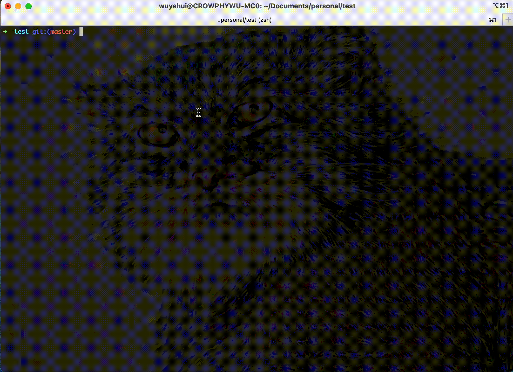

# 终端命令组合与美化

一键安装常用的终端插件，组合常用的命令，让你少敲几下键盘

[TOC]
## 前言
你是否在提交代码的时候还在使用`git add .`然后`git commit -m 'xxx'`最后再`git push`（在这之前可能还要再`git fetch/rebase/pull`更新一下）？然鹅大多数情况下只有`commit`的时候才需要填写自定义的信息，如果把这三个命令或者其他常见的组合命令合为一个操作是不是能帮我们省不少事？

## 先效果(简写、提示、高亮)



> 这里`gst`代表的是`git status`、`gcpr`代表了前言所说的几个操作的组合、`nis`表示`npm instal1 -S`。绿色代表这个命令是存在的，红色代表命令不存在，同时也会提示之前的输入记录。
## 使用说明

1. 在你的终端下执行下面的脚本即可：

   `sh -c "$(curl -fsSL https://raw.github.com/crowphy/terminal-enhance/master/index.sh)"`

>该脚本首先会安装[Oh My Zsh](https://ohmyz.sh/)，然后在home目录下添加两个配置文件`.commoncmdrc`和`.privatecmdrc`，`.commoncmdrc`中的配置与[远程仓库](https://github.com/crowphy/terminal-enhance/blob/master/index.sh)保持一致，若要更新，再次执行上述命令即可；`.privatecmdrc`为空文件，不会被更新，可以添加自己定义的一些快捷命令等。

## 插件

1. 命令提示: `zsh-autosuggestions`
2. 语法高亮: `zsh-syntax-highlighting`

## 别名

macOS(*nix)的终端工具其实已经自带了许多命名别名，通过执行`alias`即可查看，其中大部分都是与 `git`相关的，基本都是单个git命令。这里针对常用的操作补充几个组合命令：

```shell
## git相关
alias gn="git clone"
# 克隆指定分支
alias gnb="git clone -b"

# 设置或移出远程仓库的地址
alias gmao="git remote add origin"
alias gmro="git remote remove origin"
alias gmau="git remote add upstream"
alias gmru="git remote remove upstream"

# 删除分支（会覆盖默认的别名）
alias gbD="git branch -D"
# 拉取远程(origin)分支到本地
gcbo () {
    git checkout -b $1 origin/$1
}
# 拉取远程(upstream)分支到本地
gcbu () {
    git checkout -b $1 upstream/$1
}

# 拉取当前分支并从master分支rebase
alias glrb="git pull --rebase origin master"

# add & commit
alias gac="git add . && git commit -m"

# 推送到当前分支的远程分支
alias gpo='echo 当前分支： $(git branch --show-current) && git push --force --set-upstream origin $(git branch --show-current)'

# 先从master分支rebase再推送当前分支
gcpr () { 
    cd $(git rev-parse --show-toplevel) && git add . && git commit -m "$1" && git pull --rebase origin master && gpo
}

# 解决冲突（会覆盖默认的别名）
alias grbc="git add . && git rebase --continue"
alias grbs="git add . && git rebase --skip"
alias grba="git add . && git rebase --abort"

## npm相关
alias ni="npm install"
alias nis="npm install -S"
alias nid="npm install -D"
alias nig="sudo npm install -g"
alias nu="npm uninstall"
alias nus="npm uninstall -S"
alias nud="npm uninstall -D"
alias nug="sudo npm uninstall -g"
alias nt="npm run test"
alias nc="npm run cov"
alias nd="npm run dev"
alias nb="npm run build"
alias nl="npm run lint"

## 其他
# 创建并cd到该目录
mdc () {
    mkdir $1 && cd $1
}
```

### macOS(*nix)中自带的别名设置(通过alias查看)

```shell
-='cd -'
...=../..
....=../../..
.....=../../../..
......=../../../../..
1='cd -'
2='cd -2'
3='cd -3'
4='cd -4'
5='cd -5'
6='cd -6'
7='cd -7'
8='cd -8'
9='cd -9'
_=sudo
afind='ack -il'
d='dirs -v | head -10'
g=git
ga='git add'
gaa='git add --all'
gap='git apply'
gapa='git add --patch'
gau='git add --update'
gav='git add --verbose'
gb='git branch'
gbD='git branch -D'
gba='git branch -a'
gbd='git branch -d'
gbda='git branch --no-color --merged | command grep -vE "^(\*|\s*(master|develop|dev)\s*$)" | command xargs -n 1 git branch -d'
gbl='git blame -b -w'
gbnm='git branch --no-merged'
gbr='git branch --remote'
gbs='git bisect'
gbsb='git bisect bad'
gbsg='git bisect good'
gbsr='git bisect reset'
gbss='git bisect start'
gc='git commit -v'
'gc!'='git commit -v --amend'
gca='git commit -v -a'
'gca!'='git commit -v -a --amend'
gcam='git commit -a -m'
'gcan!'='git commit -v -a --no-edit --amend'
'gcans!'='git commit -v -a -s --no-edit --amend'
gcb='git checkout -b'
gcd='git checkout develop'
gcf='git config --list'
gcl='git clone --recurse-submodules'
gclean='git clean -fd'
gcm='git checkout master'
gcmsg='git commit -m'
'gcn!'='git commit -v --no-edit --amend'
gco='git checkout'
gcount='git shortlog -sn'
gcp='git cherry-pick'
gcpa='git cherry-pick --abort'
gcpc='git cherry-pick --continue'
gcs='git commit -S'
gcsm='git commit -s -m'
gd='git diff'
gdca='git diff --cached'
gdct='git describe --tags `git rev-list --tags --max-count=1`'
gdcw='git diff --cached --word-diff'
gds='git diff --staged'
gdt='git diff-tree --no-commit-id --name-only -r'
gdw='git diff --word-diff'
gf='git fetch'
gfa='git fetch --all --prune'
gfo='git fetch origin'
gg='git gui citool'
gga='git gui citool --amend'
ggpull='git pull origin "$(git_current_branch)"'
ggpur=ggu
ggpush='git push origin "$(git_current_branch)"'
ggsup='git branch --set-upstream-to=origin/$(git_current_branch)'
ghh='git help'
gignore='git update-index --assume-unchanged'
gignored='git ls-files -v | grep "^[[:lower:]]"'
git-svn-dcommit-push='git svn dcommit && git push github master:svntrunk'
gk='\gitk --all --branches'
gke='\gitk --all $(git log -g --pretty=%h)'
gl='git pull'
glg='git log --stat'
glgg='git log --graph'
glgga='git log --graph --decorate --all'
glgm='git log --graph --max-count=10'
glgp='git log --stat -p'
glo='git log --oneline --decorate'
globurl='noglob urlglobber '
glod='git log --graph --pretty='\''%Cred%h%Creset -%C(auto)%d%Creset %s %Cgreen(%ad) %C(bold blue)<%an>%Creset'\'
glods='git log --graph --pretty='\''%Cred%h%Creset -%C(auto)%d%Creset %s %Cgreen(%ad) %C(bold blue)<%an>%Creset'\'' --date=short'
glog='git log --oneline --decorate --graph'
gloga='git log --oneline --decorate --graph --all'
glol='git log --graph --pretty='\''%Cred%h%Creset -%C(auto)%d%Creset %s %Cgreen(%cr) %C(bold blue)<%an>%Creset'\'
glola='git log --graph --pretty='\''%Cred%h%Creset -%C(auto)%d%Creset %s %Cgreen(%cr) %C(bold blue)<%an>%Creset'\'' --all'
glols='git log --graph --pretty='\''%Cred%h%Creset -%C(auto)%d%Creset %s %Cgreen(%cr) %C(bold blue)<%an>%Creset'\'' --stat'
glp=_git_log_prettily
glum='git pull upstream master'
gm='git merge'
gma='git merge --abort'
gmom='git merge origin/master'
gmt='git mergetool --no-prompt'
gmtvim='git mergetool --no-prompt --tool=vimdiff'
gmum='git merge upstream/master'
gp='git push'
gpd='git push --dry-run'
gpf='git push --force-with-lease'
'gpf!'='git push --force'
gpoat='git push origin --all && git push origin --tags'
gpristine='git reset --hard && git clean -dfx'
gpsup='git push --set-upstream origin $(git_current_branch)'
gpu='git push upstream'
gpv='git push -v'
gr='git remote'
gra='git remote add'
grb='git rebase'
grba='git rebase --abort'
grbc='git rebase --continue'
grbd='git rebase develop'
grbi='git rebase -i'
grbm='git rebase master'
grbs='git rebase --skip'
grep='grep  --color=auto --exclude-dir={.bzr,CVS,.git,.hg,.svn}'
grh='git reset'
grhh='git reset --hard'
grm='git rm'
grmc='git rm --cached'
grmv='git remote rename'
groh='git reset origin/$(git_current_branch) --hard'
grrm='git remote remove'
grset='git remote set-url'
grt='cd $(git rev-parse --show-toplevel || echo ".")'
gru='git reset --'
grup='git remote update'
grv='git remote -v'
gsb='git status -sb'
gsd='git svn dcommit'
gsh='git show'
gsi='git submodule init'
gsps='git show --pretty=short --show-signature'
gsr='git svn rebase'
gss='git status -s'
gst='git status'
gsta='git stash save'
gstaa='git stash apply'
gstall='git stash --all'
gstc='git stash clear'
gstd='git stash drop'
gstl='git stash list'
gstp='git stash pop'
gsts='git stash show --text'
gsu='git submodule update'
gts='git tag -s'
gtv='git tag | sort -V'
gunignore='git update-index --no-assume-unchanged'
gunwip='git log -n 1 | grep -q -c "\-\-wip\-\-" && git reset HEAD~1'
gup='git pull --rebase'
gupa='git pull --rebase --autostash'
gupav='git pull --rebase --autostash -v'
gupv='git pull --rebase -v'
gwch='git whatchanged -p --abbrev-commit --pretty=medium'
gwip='git add -A; git rm $(git ls-files --deleted) 2> /dev/null; git commit --no-verify -m "--wip-- [skip ci]"'
history=omz_history
l='ls -lah'
la='ls -lAh'
ll='ls -lh'
ls='ls -G'
lsa='ls -lah'
md='mkdir -p'
rd=rmdir
run-help=man
which-command=whence
```

## 其他

如果有其他共享的可以直接提mr合入或者提issue
